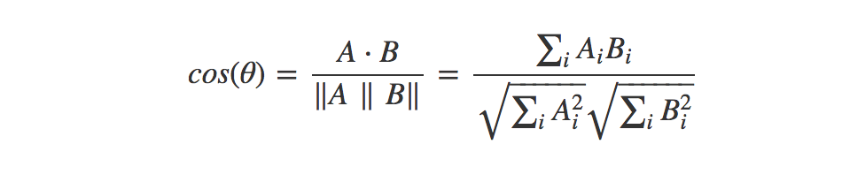
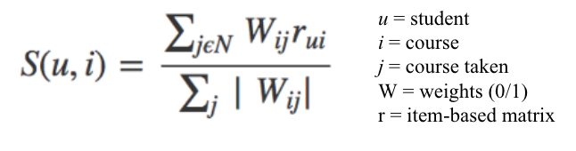
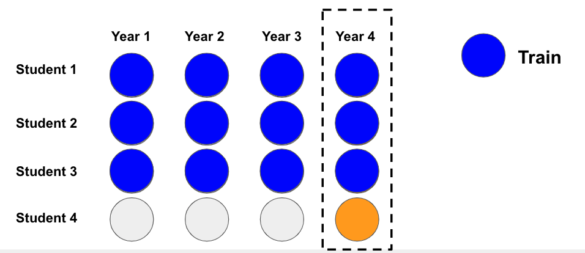
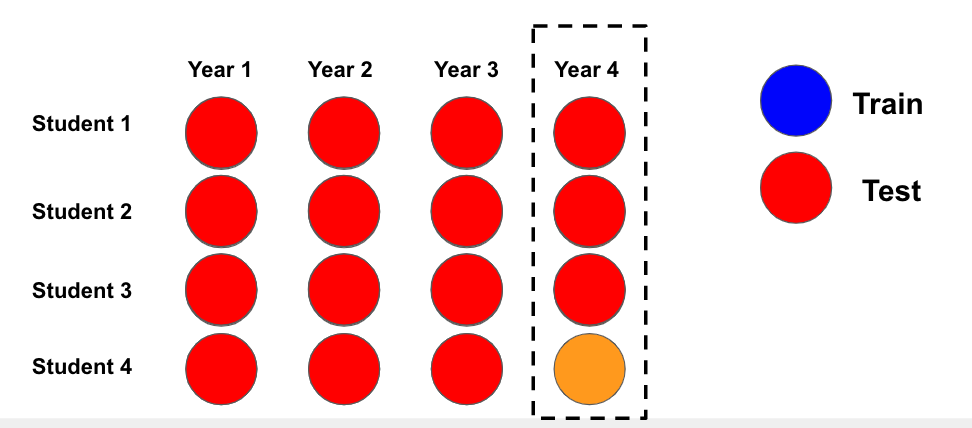
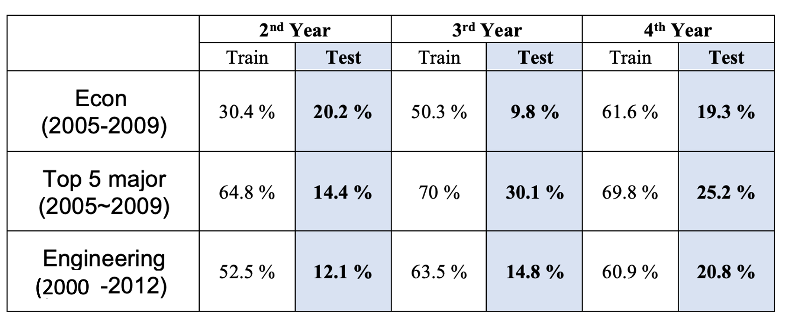
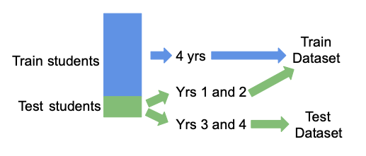
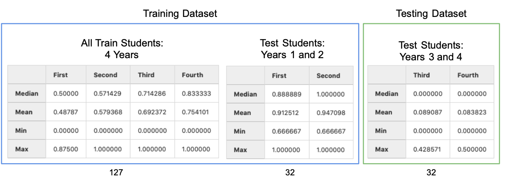
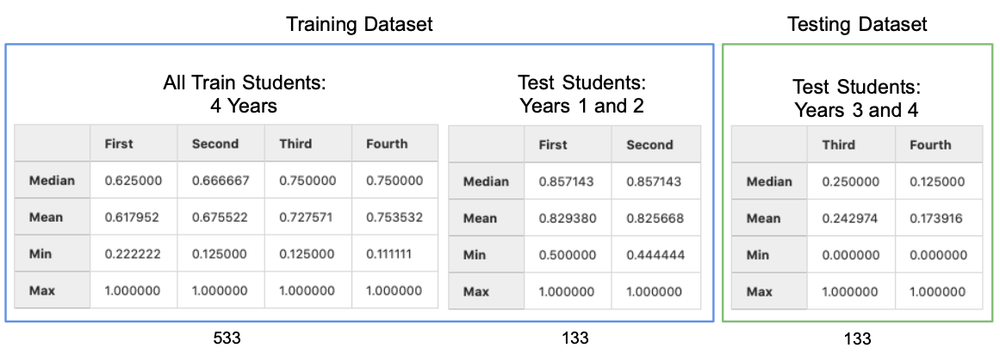
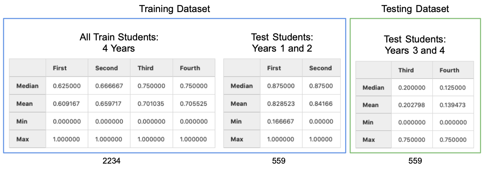

# Course Recommendation System for Duke Registrar

**Authors:**
Vanessa Tang, Sangseok Lee, Yiran Chen

**Hypothesis/Goal/Aim:**
We aim to understand how past student class enrollment and completion data can help guide current students in class selection by constructing a personalized course recommendation system.

**Objectives with (short, one-sentence) justification:**
With a personalized course recommendation system, the current students will be able to see what classes the past students took in each major to help guide their own course selection. The information of the order as well as the combination of the classes taken in the past will help facilitate course load planning, order, and selection for future students leading to their academic success.

**Audience:** Academic Audience

**Style:** White Paper

**Abstract:**
(Place holder; to be written only after rest of paper is complete and not in the outline)

## Introduction

Course selection is often a daunting and time-consuming process. With countless course options and a wide variety of requirements or considerations, students often have difficulty selecting courses or planning their course pathway. Course selection can depend on a wide variety of factors, including graduation requirements, major or minor requirements, location, timing, professor, or suggestions from peers. To help facilitate the course selection process, this project aims to develop a recommender system to recommend courses to undergraduate students at Duke University.

 An ideal recommender system will aim to recommend courses whose content best matches the student’s academic interests (major, minor, certificate, secondary), identify the student's academic pathways, and also presents predicted grades with respect to different course selections according to the student's academic history. In addition to a traditional scoring scheme measuring how desirable a certain course is for one student, the ideal recommender will also take into account the academic requirements and provide more practical and personalized suggestions.

While recommender systems are popular today, used in platforms like Netflix and Amazon, this project presents various different challenges that make developing such a course recommender system unique. First, the data has a temporal aspect, as course order matters and course taking patterns from semester to semester may change as a student changes preferences. Furthermore, many courses have prerequisites. A second challenge stems from the natural variability in the courses that students take. Duke students enter as undeclared majors and by the start of their third year, all students must declare a major. However, students are able to change majors, which can create noise and variability in the data. In addition, graduation and major requirements change frequently, and we do not have data for these changes, so the recommender system is unable to account for requirements.

Based on these restrictions and challenges, we are currently aiming to develop a course recommender system based on the courses a student has taken and past course-taking patterns.

## Data

From the Duke Registrar, we are provided with a dataset containing all the courses each student took at Duke, including course number and description, in addition to the grade received. We also have degree information include majors, minors, certificates, and secondaries that each student graduated with in addition to the corresponding school. In 2012, courses were renumbered and restructured, and the courses in pre-2012 and post-2012 timeframes cannot be linked. Therefore, we have two timeframes of data: one spanning 2000 to Spring 2012 and the second spanning Fall 2012 to present. We are first focusing EDA and model-building on the first segment of data. Future practical applications of a course recommender system will integrate current data and course structures.

The degree dataset includes graduated students' de-identified ID's, graduation year, and major, minor, certificate, or secondary degree descriptions. The course enrollment dataset includes de-identified ID numbers that correspond to those in the degrees dataset in addition to course descriptions, grades received, and academic year for every course each student took at Duke. The data dictionary can be found in the Appendix.

**Preprocessing:**
Because there are two datasets with student information, we combined these datasets by merging on student ID (`Calculation ID`) to create a dataset with one row for every course taken per student and separate columns for major, minor, certificate, and secondary degree information merged from the degrees dataset. This is helpful because this dataset now has one row per item, which facilitates model-building for most recommender systems. Furthermore, this better integrates degree information as Duke students can have any three combination of major, minor, certificate, and secondary. This degree information may be helpful in future modeling as user-based features. 

## Exploratory Data Analysis

There are about 6,000 to 7,000 undergrad students enrolled at Duke every year. However, due to the structure of our datasets, the number of students incrementally decreases in the last few years as students “drop off” the dataset given the range of dates as students in 2010 graduate in 2014 but the dataset ends at 2012. These students are not included in this dataset. Thus, EDA and model building must account for inconsistencies at each end of the dataset’s years.

Every student graduates with a major, but at Duke, students have the option of combining three of these options: major (MAJ), minor (MIN), secondary (SEC), and certificate (CER). Because there are many different combinations of majors, minors, secondary, and certificates and all students must graduate with a major, we plan to first focus on course planning for a student’s major. Focusing on major only, we start by using selected subsets of data below to build a prototype.

### Data Subsetting

To facilitate model building and testing, we are working primarily with two small subsets of data. The first consists of all Economics (BS) majors who enrolled at Duke in 2005 and graduated in 2009. The second consists of students with the top 5 most popular majors (Biology (BS), Economics (BS), Public Policy (AB), Biomedical Engineering (BSE), Political Science (AB)) who enrolled in 2005 and graduated in 2009. These two datasets give us a complete set of students for which we have all courses taken during their four years at Duke. Subsetting by major is also helpful in narrowing down the search space and courses taken, potentially making it easier to recommend courses for students within a certain major(s). We aim to expand on this in the future, as a final recommendation engine would ideally be able to recommend courses for any major.

With the addition of school-level information by major, we have also created a third subset of data including all majors within the undergraduate engineering school. This is done for three primary reasons. The first reason is to construct a dataset that is slightly larger than the previous economics and top-5-major subsets by increasing the time frame and majors included. Second, this dataset of engineering students includes relatively similar majors. Last, engineering students tend to have more linear, straightforward pathways that may be easier to track than other fields such as the humanities

Dataset          |     Date Range     |      Num. Student       |       Num. Majors
-----------------|---------------------|---------------------------|-------------------------
Econ                |   2005 - 2009       |              159                    |                    1
Top 5               |   2005-2009         |              666                    |                    5
Engineering |    2000-2012        |             2793                   |                    6

## Dynamic Course Dashboard

One intuitive way to map students' academic pathway is based on the most most popular classes taken during a given semester for a given major. We have created a Tableau dashboard that shows popular classes for a selected semester for a selected major. It also provides an option to select courses for a given graduation year, as course patterns change over time, so viewing only recent graduates' course history is most reliable. This helps students in course selection to see what most recent graduates with the same major have taken in the semester of interest.


To facilitate long-term course planning, a Pathway dashboard is also created. This shows the 5 most popular courses to take for each term from Freshman to Senior year given a certain major, which can help a current student plan course selection for their entire time at Duke accordingly. Likewise, this dashboard provides an option to only select recent graduates' course history to account for course pattern changes that occur over time. The dashboards will serve as a helpful reference especially for the first year students whose course history is unavailable.


## Models

### Cosine Similarity Model

#### Contet-based Filtering versus Collaborative Filtering
 **Content-based filtering ** 
 
Content-based filtering uses item features to recommend other items similar to what the user likes, based on their previous actions or explicit feedback. This model can capture the specific interests of a user, and can recommend niche items that very few other users are interested in. However, item features  are required for a good performance in the recommendation. In other words, the model will perform well only if we have enough item features given our dataset. 

 **Collaborative filtering ** 

To address some of the limitations of content-based filtering, collaborative filtering uses similarities between users and items simultaneously to provide recommendations. This model can recommend an item to user A based on the interests of a similar user B. Furthermore, this model can perform well without relying on item features. While it is hard to include features beyond item ID, this model can help users discover new interests because similar users are interested in an item that a user may not be interested in. For this reason, we apply collaborative filtering for our course recommendation since our data has a small number of features.

#### Recommendation with collaborative filtering

**class-class relationship**
First of all, we calculate the magnitude of all the user's class selection by taking the square root of the sum of the squares of all the user's class selection.
```math
magnitude = \sqrt{(x^2+y^2+z^2 + ...)} 
```
We then create the new unit vector by dividing the class selection by the magnitude:
 \begin{equation} vector = (\frac{x}{magnitude},\frac{y}{magnitude},\frac{z}{magnitude}, ...)  \end{equation}

Second, we calculate the cosine similarity between the classes using this formula:



In other words, we take the dot-product of our different class-vectors and divide it by the product of the normalized vectors. A normalized vector is the euclidean distance (or L2-norm) of that vector which means the square root of the sum of the absolute values squared:


With these two steps, we construct a new class by class matrix containing the weights (relationships) between each of our classes where a perfect correlation equals 1 and no correlation at all equals 0.

 **User-item relationship**
Now that we have our similarity matrix, we obatin user's known likes and their similarities. Basically, we want to create a score for each class in our dataset for that student and then we can simply choose the n items with the highest score.

To get the score, we use this formula:


we get the score for user $`u `$and item $`i`$ by summing together all the weights for that item $`W_{ij}`$ multiplied with the users rating for that item $`r_{ui}`$. We then divide by the sum of all the weights for that item $`W_{ij}`$.  With this formula, we get a list of recommended classes. The highest score is the class that his/her nearest neighbors have taken.


 **Train-Test Split** 
The dataset has has temporal aspect from year1 to 4 per student and include all courses that students took during each year. Due to sequential order, we split train and test data with different approach from the traditional way of splitting data. 

If we want to predict the courses student 1 would take during year 4, we feed blue circles as our training data and predict classes at year 4 as following:


For test data, we want to predict the courses student 4 would take during year 4. We  feed training data and all classes student 4 has taken before year 4. 



#### Results



Based on these results, we can see that Cosine Similarity Model works well in training data, but rapidly decreases the accuracy with the test data. It seems that the power of our recommendation is the strongest at 4th year, followed by 3rd year and 2nd year. This demonstrates that the more data you feed in, the stronger the prediction power will be.

### Latent Factor Models (Matrix Factorization)

**Purpose of section:**
Latent Factor models (LFMs) are a state-of-the-art method for model-based Collaborative Filtering (CF). It is assumed that there exist an unknown low-dimensional representation of users and items with which the user-item affinity can be modeled accurately [2]. For example, the grade the student receives from a course might be assumed to depend on few implicit factors such as the student's preference across various course subjects. Matrix factorization is a class of widely successful Latent Factor models that attempt to find weighted low-rank approximations to the user-item matrix.

#### Singular Value Decomposition (SVD)

**Overview:**
Singular value decomposition (SVD) is a very popular matrix factorization technique for recommender systems. However, as previously stated, SVD is most commony used for explicit datasets where user feedback such as ratings is available. Given our dataset, we do not have explicit data but implement SVD using numerical grades. In the context of our problem, SVD works according to the following equation:

```math
 R = U \Sigma V^T
```

 _R_: predicted student grades  
 U: student grades  
 Σ: diagonal matrix of singular values (weights)  
 V<sup>T</sup>: courses
 
 Then, we keep the top k features as the most important underlying preference vectors (latent features).

Using this algorithm, we run SVD for each dataset, then use the same `RecommendCourses` class (See Appendix) to recommend courses for each student. This class facilitates course recommendation with easy methods to view all courses actually taken, rankings of recommendations, and recommended courses actually taken. Accuracy is calculated by dividing the number of courses taken in the top n recommendations by the total number of courses taken for a given time period.

**Train Test Split:**

**By Time:**
Previously, we had split data into training and test sets based on time. For example, if we were interested in recommending courses for the third year, then the training set would include years 1 and 2, and the test set would include years 3 and 4. However, after further discussion and thought, we decided to try splitting based on student ID (`Calculation ID`). This is because a split based on time may not capture courses that students can only take in the latter years. For example, if we were to split data into years 1 and 2 in a training set and years 3 and 4 in a test set, then the model may train on data that does not include some of the courses seen in year 3 and 4 data. Thus, the recommender system would never recommend these courses, as it has no way of knowing that it actually exists.

**By Student ID:**
After testing time-based splits, we proceeded to test splitting students into two groups: train students (80%) and test students (20%). Based on these splits, we also split the test students by time, which would emulate current students with a certain number of years already in the dataset but using the recommender system to find courses for the following year. Therefore, the test student group was split by time into two groups: one containing the first and second years of course data and a second containing the third and fourth years of course data. We aim to recommend courses for the third and fourth years of data for these test students. Thus, SVD is performed on 4 years of data from the training students group and the first 2 years of data from the test students group. 



**Results:**
Based on these results, we can see that SVD performs relatively well on the training set but struggles with the test set. Generally, we can see that accuracy increases every year. Furthermore, SVD performs better on the larger datasets of the top 5 majors and the engineering students. This performance difference is especially evident in the test results where the economics subset struggles significantly.  

**Economics 2005-2009 Subset:**



**Top 5 Majors 2005-2009 Subset:**



**Engineering Subset:**



#### LightFM

**Overview:**
LightFM is one established hybrid matrix factorization model. It learns embeddings for users and items in a way that encodes user preferences over items. When multiplied the two matrices together, these representations produce scores for every item for a given user. Such hybrid recommendation algorithm combines both the concepts of content-based recommendation models and collaborative filtering. It is able to solve the cold start problem, where recommender systems struggle to recommend for new users, which is commonly seen in recommendation settings. They also work better for new data utilizing similarities based on user features.

**Preprocessing:**
The student (user) feature matrix is constructed by dummifying the students' minor choices as categorical features. Similarly, the course (item) feature matrix is constructed by dummifying the courses' timing as in which class year they took place as categorical features. The student-course (user-item) interaction matrix is built using normalized grade with respect to each student serving as a proxy of ratings usually used in recommandation systems.

We get the latent representation of each feature for every item and user. Following this idea, the latent representation of a item is just the sum of the latent representations of the item’s features. Similarly for users, we just add the latent representations of the user’s features to get the latent representation for a user. The score for a item-user pair is the cosine similarity of the latent representations of the item and the user.

**Hyperparameters:**
The loss function used is Weighted Approximate-Rank Pairwise loss (WARP). Such loss selection is common as here only positive interactions are present and optimising the top of the recommendation list (precision@k) is desired. The dimensionality of the feature latent embeddings is set as 300 with learning rate of 0.01 in 100 epochs.

**Results:**
We will be focusing on validation metric of accuracy for top k recommended courses over courses actually taken, using the prior years' data of a successfully graduated student and predict for course selections for the year of interest.

From the LightFM model, the accuracy is fairly low to predict the correct courses in the fourth year (generally around 10%). It might be due to the fact that there is a limited number of courses taken each year even though many course predictions can be made. In addition, the model might find it difficult to distinguish between courses with similar names but in different domains, or courses that share different names but lie in the same subject. This would require further investigation on the word embeddings on the courses to form representative cluster structures. 

Unlike normal recommendation system where there are no constraints on the items recommended, in the academic setting, we need to exclude the courses already taken, and take the temporal aspect of courses into consideration. The sequence of courses across the four year have significant importance, mainly due to prerequisites. We aim explore other modeling techniques that can account for this temporal aspect.

The train/test split is using only the data up to the year of interest as training data and predict recommended courses for the year of interest.

| Accruacy @ K        | Second Year | Third Year    | Fourth Year
| ---------------------- |------------------|----------------|-----------------|
| Econ 05-09 k=15  | 18.7%            |  14.6%       | 12.1%         |
| Econ 05-09 k=30  | 32.1%            |  23.7%       | 21.1%          |
| Top5 05-09 k=15  | 13.6%            |  11.3%       | 9.5%            |
| Top5 05-09 k=30  | 29.6%            |  22.0%       | 19.4%          |

#### Other Models

**MatchBox:**
MatchBox is an on-line learning algorithm capable of incrementally taking account of new data so the system can immediately reflect the latest user preferences. Developed by Microsoft, it is an easily implemented algorithm that can provide similar users as well as similar items.

**Implicit ALS:**
The goal is to convert user behavior into user preferences which indirectly reflect opinion through observing user behavior. As the rating information is unavailable, the data is referred as implicit, which we are using matrix factorization method of alternating least squares (ALS) to process. ALS is an iterative optimization process where we for every iteration try to arrive closer and closer to a factorized representation of our original data.

Instead of explicit ratings, the normalised grades are used representing a “confidence” in terms of how strong the interaction was. Courses with a higher value of GPA by a person can carry more weight in the "ratings" matrix of normalized grade.

From the trained model, we will be able to obtain the user and item vectors, from which the vector norms and similarity scores are calculated to produce corresponding recommendations.

## Future Work

- It is neccessary to narrow down the search space for course recommendations. This can be achieved with further feature extraction, course clustering, or course filterings.
- Next, we also need to find more effective vector representations of course information. Tuning the hyperparameters to make the model more efficient.
- Most importantly, we will implement post-recommendation filtering to automatically exclude certain courses (such as courses which have prerequisites) to improve the accruracy.
- Implement with larger dataset size.

## Conclusion/Discussion

(Place holder)

## References

1. Morsomme, R., & Alferez, S. V. (2019). Content-Based Course Recommender System for Liberal Arts Education. International Educational Data Mining Society.
2. Sammut, C., & Webb, G. I. (2010). Latent Factor Models and Matrix Factorizations.

## Appendix

### Data Dictionary

* Calculation ID:​ anonymized student ID
* Acad Plan:​ shorthand/abbreviation for major/minor/certificate/secondary
* Acad Plan Descr:​ description of acad plan (major/minor/certificate/secondary)
* Plan Type:​ denotes major/minor/certificate/secondary
* Degree:​ abbreviated type of degree (AB, BS, BSE)
* Descr_completions:​ type of degree (Bachelor of Arts, Bachelor of Science, Bachelor of Science in Engineering)
* Comp Term Descr:​ academic year and term of graduation
* Acad Year_completions:​ academic year of graduation
* Subject:​ subject of course
* Catalog:​ course number
* Descr_enrollment:​ name of course
* Grade:​ grade received in descr_enrollment
* Term Descr:​ academic year and term of enrollment in class
* Acad Year_enrollment:​ academic year of course enrollment
* Enrollment Start:​ first year student has registered for classes at Duke
* Term Year:​ year student is taking course
* Semester Term:​ term student is taking course (Fall, Spring, Summer 1, Summer 2)
* Class Year:​ indicates freshman through senior year (or more) and term (First Year Fall Term, First Year Spring Term, etc.)

### `RecommendCourses` Class

The `RecommendCourses` class has the following methods:

 - `course_scores`: Returns all courses and scores for student sorted in descending order of score
 - `all_courses_taken`: Returns all the courses the student has taken during the entire time at Duke
 - `courses_taken_until_term`: Returns courses taken up until term/year of interest (ex: Looking to recommend for Third year, returns all courses taken in First and Second years.)
 - `courses_taken_in_term`: Returns the courses that the student actually took in term/year of interest
 - `recommend_for_all_course`: Recommends courses given all the courses student took during entire time at Duke (not sure about this one)
 - `recommend_for_term`: Recommends courses given the courses the student has taken until term of interest
 - `rank_recs`: Adds rankings to recommendation (helper function)
 - `top_n_recs`: Returns top n recommendations
 - `calculate_accuracy`: Calculates accuracy based on number of recommended courses student took divided by number of courses taken in term